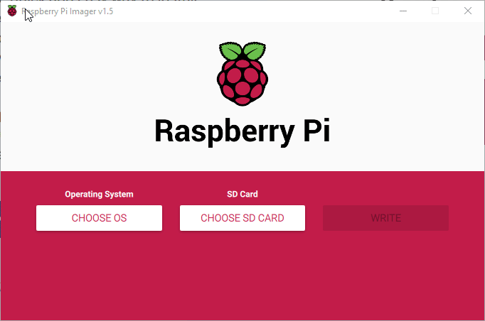
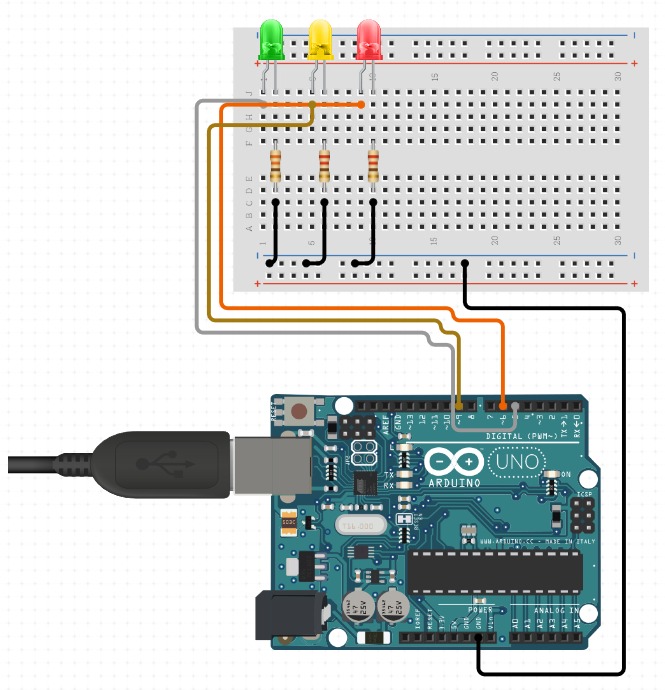
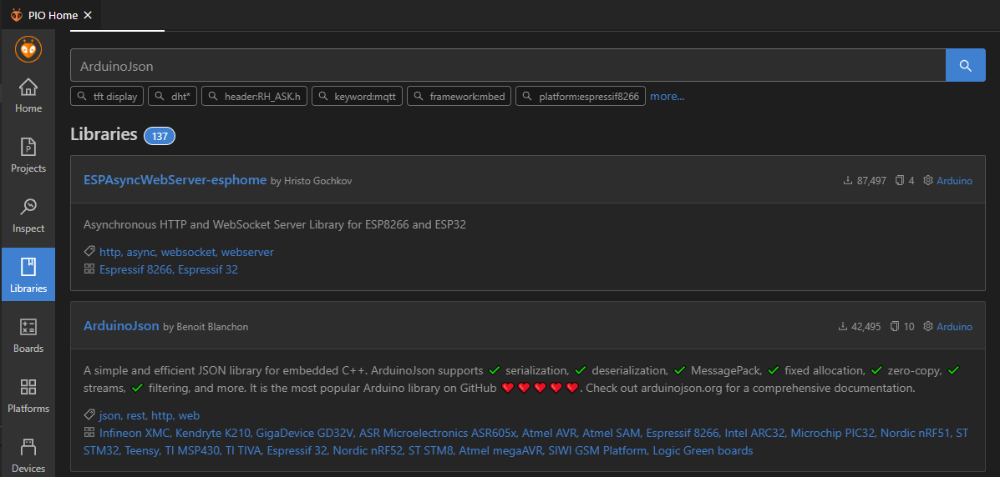
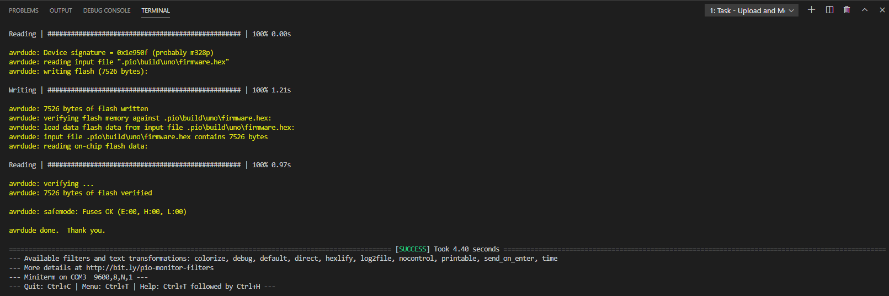
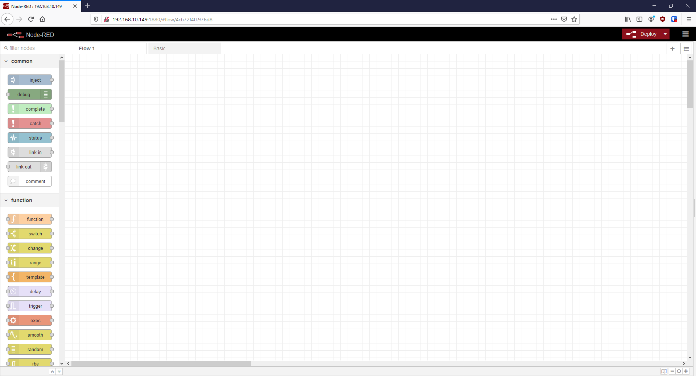
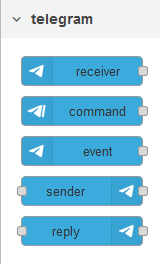
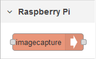
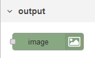
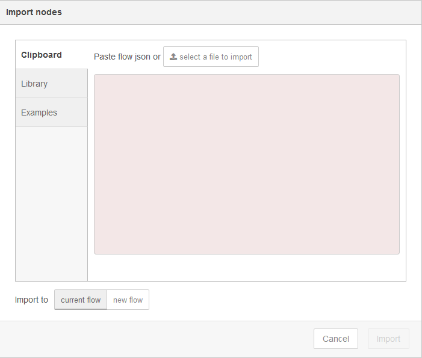
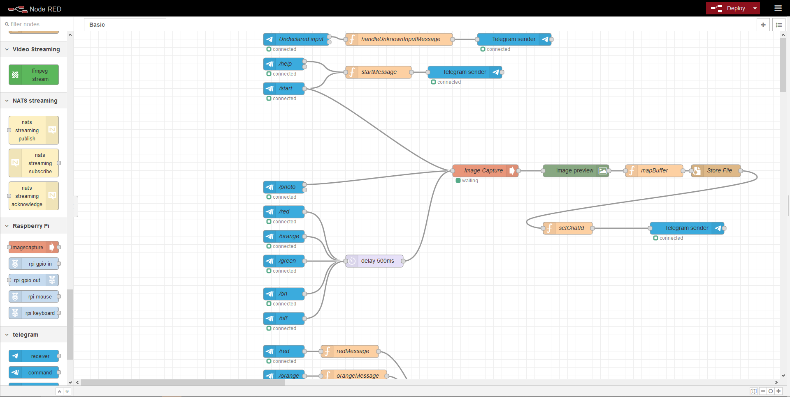

<h1> Telegram bot control for LED using Raspberry Pi, Arduino and Node-RED </h1>

This project...

- [1. Raspberry Pi Setup](#1-raspberry-pi-setup)
- [1.1 Write Raspian image](#11-write-raspian-image)
- [1.2 Setup Raspberry Pi Networking and interface](#12-setup-raspberry-pi-networking-and-interface)
  - [Option 1: Ethernet](#option-1-ethernet)
  - [Option 2: Wi-Fi](#option-2-wi-fi)
  - [Option 3: Headless](#option-3-headless)
- [2. Arduino LED Control over serial](#2-arduino-led-control-over-serial)
  - [1.1 Circuit diagram](#11-circuit-diagram)
  - [1.2 Programming the Arduino](#12-programming-the-arduino)
- [3. Setup NODE-RED  on Raspberry Pi](#3-setup-node-red--on-raspberry-pi)
  - [2.1 Installing dependencies](#21-installing-dependencies)
  - [2.2 Import flow ##](#22-import-flow-)

# 1. Raspberry Pi Setup #


# 1.1 Write Raspian image #
Write the SD card of the Raspberry Pi using the [Raspberry Pi Imager](https://www.raspberrypi.org/software/):



This will take a while depending on your internet connection... grab a cup of coffee.

# 1.2 Setup Raspberry Pi Networking and interface #

## Option 1: Ethernet ##

## Option 2: Wi-Fi ##

## Option 3: Headless ##

# 2. Arduino LED Control over serial #


## 1.1 Circuit diagram ##
Create circuit with Arduino, LEDs and resistors:



Update the pin varialbes in `/src/main.cpp` to match your particular wiring to PWM pins:
```C++
const int redPin = 6;
const int orangePin = 9;
const int greenPin = 5;
```
## 1.2 Programming the Arduino ##
Run in [PlatformIO](https://platformio.org/):

1. Add `ArduinoJSON` library:
 - 
2. Project Tasks:
 - `Build`, then `Upload and Monitor` 
3. Type in Serial Window (input will be hidden):
    ```json
    //send 'red' over serial:
    {"red":false,"orange":true,"green":true}
    //send 'orange' over serial:
    {"red":false,"orange":false,"green":true}
    //send 'green' over serial:
    {"red":false,"orange":false,"green":false}
    //send 'red' over serial again:
    {"red":true,"orange":false,"green":false}
    //send 'on' over serial again:
    {"red":true,"orange":true,"green":true}
    //send 'off' over serial again:
    {"red":false,"orange":false,"green":false}
    ```

# 3. Setup NODE-RED  on Raspberry Pi #

Node-RED is already installed on recent versions Raspbian, so start it up and open up the UI in a browser:



## 2.1 Installing dependencies ##

Before importing the flow, you'll need to import the following palette modules:
1. [node-red-contrib-telegrambot](https://flows.nodered.org/node/node-red-contrib-telegrambot) - used to communicate with your telegram bot. 
   - 
2. [node-red-contrib-rpi-imagecapture](https://flows.nodered.org/node/node-red-contrib-rpi-imagecapture) - used to capture an image using a webcam connected to the Raspberry Pi with USB. 
   - 
3. [node-red-contrib-image-output](https://flows.nodered.org/node/node-red-contrib-image-output) - used to display the captured image in the flow for debugging purposes.
   - 

For reference:  After installing all these packages through the UI, these were the versions of the libraries tested on a vanilla Raspbian build:
```bash
pi@raspberrypi:~/.node-red $ npm list --depth 0
npm WARN npm npm does not support Node.js v10.21.0
npm WARN npm You should probably upgrade to a newer version of node as we
npm WARN npm cannot make any promises that npm will work with this version.
npm WARN npm Supported releases of Node.js are the latest release of 4, 6, 7, 8, 9.
npm WARN npm You can find the latest version at https://nodejs.org/
node-red-project@0.0.1 /home/pi/.node-red
├── node-red-contrib-image-output@0.6.2
├── node-red-contrib-rpi-imagecapture@0.0.2
└── node-red-contrib-telegrambot@8.9.6
```


## 2.2 Import flow ## 
In the top-right menu, select **import**:



Select the file `.node-red-flow/flows.json` and import it. The flow should resemble this:

