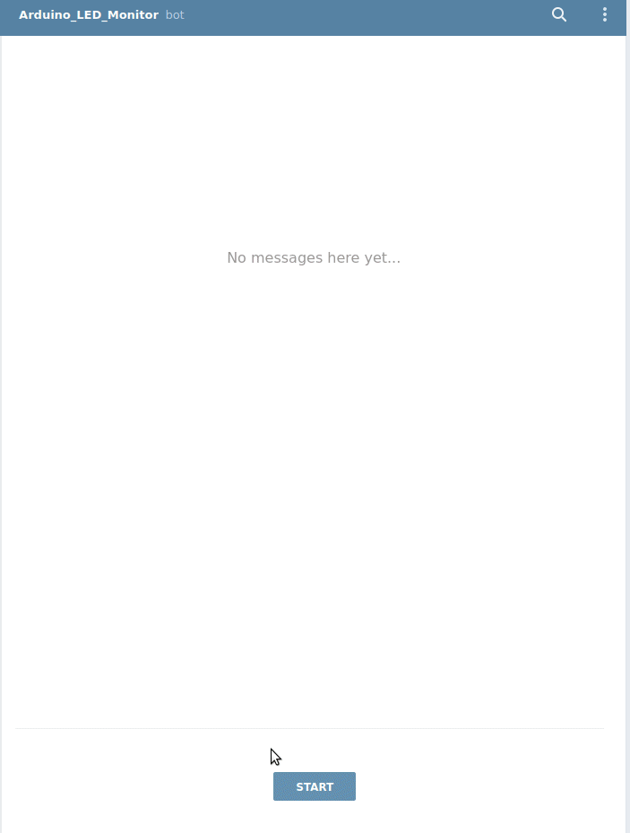
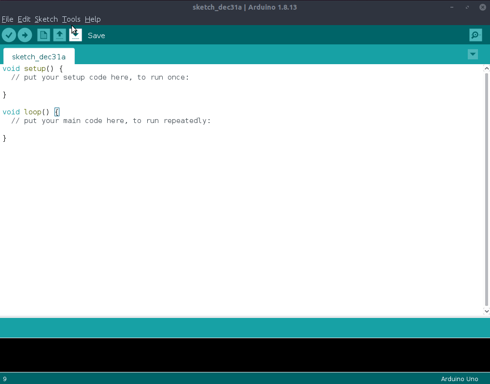
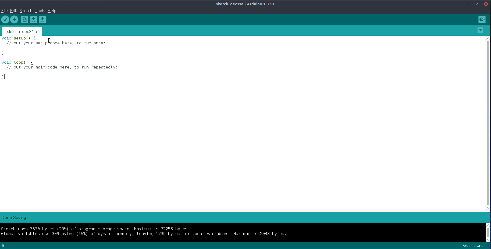
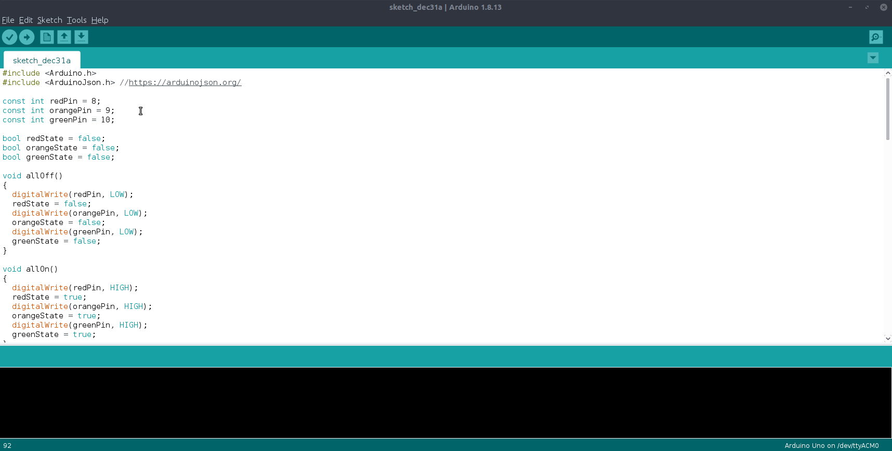
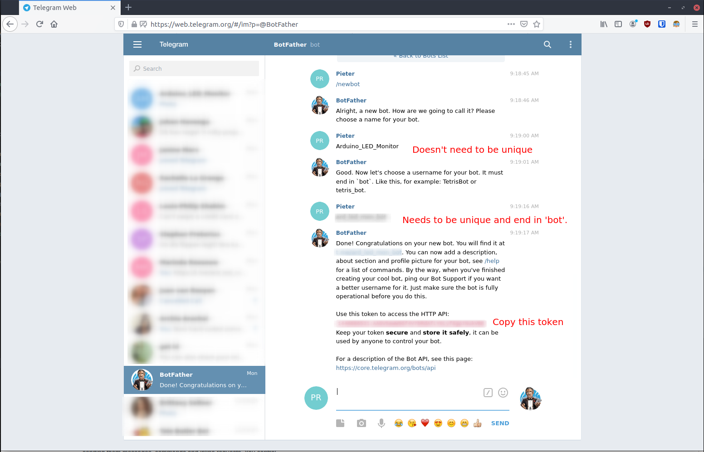
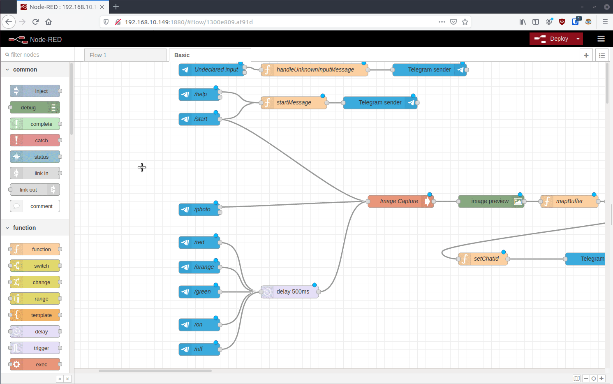
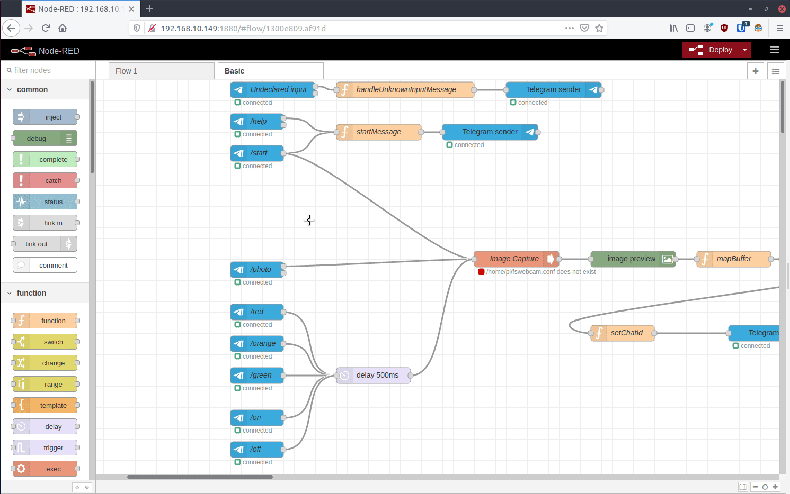

<h1> Telegram bot control for LED using Raspberry Pi, Arduino and Node-RED </h1>

This project is a fun project intended for those new to Raspberry Pi, Arduino and/or electronics to build something that combines many real-world skills including:

- Section 1 - Raspberry Pi:
  - Computer networking.
  - Command line interface and package-management with Linux.
  - Introduction to server/client computing.
- Section 2 - Arduino:
  - Basic circuit design and logic using a breadboard and dupont-jumpers.
  - Introduction to serial interfaces.
  - Software dependencies.
- Section 3 - Node-RED:
  - Introduction to systems-thinking and dataflow.
  - Integration of distinct systems.

What this guide will help you build is a Telegram bot that allows you to control LED lights over the internet.



This goal was chosen specifically to introduce integrated systems thinking - a skill that is required for anyone persuing Computer Science, Information Technology or Engineering fields.

<h3>Table of contents:</h3>

- [1. Raspberry Pi Setup](#1-raspberry-pi-setup)
  - [1.1 Write Raspian image](#11-write-raspian-image)
  - [1.2 Setup Raspberry Pi Networking and Interface](#12-setup-raspberry-pi-networking-and-interface)
    - [1.2.1 Interfacing Option 1: Local keyboard, mouse and monitor/TV](#121-interfacing-option-1-local-keyboard-mouse-and-monitortv)
    - [1.2.2 Interfacing Option 2: Headless](#122-interfacing-option-2-headless)
  - [1.3 First boot](#13-first-boot)
- [2. Arduino LED Control over serial](#2-arduino-led-control-over-serial)
  - [1.1 Circuit diagram](#11-circuit-diagram)
  - [1.2 Programming the Arduino](#12-programming-the-arduino)
- [3. Setup NODE-RED Telegram bot](#3-setup-node-red-telegram-bot)
  - [3.1 Installing dependencies](#31-installing-dependencies)
  - [3.2 Import flow](#32-import-flow)
  - [3.3 Provide configuration](#33-provide-configuration)
  - [3.4 Bonus: Add USB Webcam](#34-bonus-add-usb-webcam)

# 1. Raspberry Pi Setup #

The Raspberry Pi is an inexpensive single-board computer that provides the needed computing to be a Internet of Things (IoT) project. It will run a software server called `Node RED` that will form the software base for letting us connect our Arduino circuit to the internet. This section will guide you through setting up your Raspberry Pi with the Raspbian operating system.

## 1.1 Write Raspian image ##
Write the SD card of the Raspberry Pi using the [Raspberry Pi Imager](https://www.raspberrypi.org/software/):


This will take a while depending on your internet connection... grab a cup of coffee.

## 1.2 Setup Raspberry Pi Networking and Interface ##

Once the Raspian image is written, you'll need to setup wireless networking for the Rasperry Pi and choose a means of interfacing with the Raspberry Pi. These are described in the following sections.

### 1.2.1 Interfacing Option 1: Local keyboard, mouse and monitor/TV ###
This is the simplest interface - you plug in your keyboard and mouse into the USB ports on the Raspberry Pi, connect your monitor to the HDMI port and finally insert the SD card in the slot on the Raspberry Pi. You're good to go - power it on and you should boot into the interface. On first boot-up you will be presented with a wizard to guide you through the networking options including the Wi-Fi setup. Continue to [1.2.5](#125-finding-the-ip-address-of-your-raspberry-pi-on-the-network) once you have completed the wizard.

### 1.2.2 Interfacing Option 2: Headless ###
If you don't have access to a spare keyboard, mouse or monitor - you'll need to use this option. Even if you have access, headless access is usually more convenient once set up. It'll allow you to control your Raspberry Pi without the need for these peripherals but will require network access to be available as soon as the Raspberry Pi starts. With an Ethernet cable this is simple but setting it up using Wi-Fi requires additional preparation before **before** inserting the SD card into the Raspberry Pi.

After the SD card has been written, it will have a `boot` partition. In the root of this partition create a file called `wpa_supplicant.conf`. Create the file with [VSCode](https://code.visualstudio.com/download) and paste this content in the file:
```bash
ctrl_interface=DIR=/var/run/wpa_supplicant GROUP=netdev
update_config=1
country=<Insert 2 letter ISO 3166-1 country code here e.g. US, UK etc.>

network={
 ssid="<Name of your wireless LAN>"
 psk="<Password for your wireless LAN>"
}
```

You'll also need to enable [SSH](https://en.wikipedia.org/wiki/SSH_(Secure_Shell)) by creating another file called `ssh` in the same root directory. This file is empty.

You can now power up your Raspberry Pi. It can take a couple of minutes for the Raspberry Pi to start up and connect to your network. You'll need to find the `IP address` of your Pi on the network so you can connect to it. I use an Android app called `Fing` to scan my network for devices. While your phone is connected to the same network as your Raspberry Pi, run the scan to find the IP address:


The app reveals that the IP address assigned to the Raspberry Pi is `192.168.10.21`. Note down the IP assigned by your router, it'll most likely be different from mine and you'll need it at several points in the guide.

## 1.3 First boot ##

With a first boot on the Raspberry Pi, there will be some configuration to do. If you have local access to the Raspberry Pi, a wizard will guide you through the process. If you have set up your Raspberry Pi in `headless` mode, you should do this configuration over `SSH`. Log in to the Raspberry Pi with a `command prompt` window:

```bash
ssh pi@<IP of Pi on your network>
# answer yes to prompt
# use the default password 'raspberry'
```
My login resembled this:
```bash
# e.g.
ssh pi@192.168.10.21
The authenticity of host '192.168.10.21 (192.168.10.21)' can't be established.
ECDSA key fingerprint is SHA256:TM3e3Z3+eHH0zng0a4qOWIC/cuPipFpUCFHp+cNZGHA.
Are you sure you want to continue connecting (yes/no/[fingerprint])? yes
Warning: Permanently added '192.168.10.21' (ECDSA) to the list of known hosts.
pi@192.168.10.21's password: 
Linux raspberrypi 5.4.79-v7l+ #1373 SMP Mon Nov 23 13:27:40 GMT 2020 armv7l

The programs included with the Debian GNU/Linux system are free software;
the exact distribution terms for each program are described in the
individual files in /usr/share/doc/*/copyright.

Debian GNU/Linux comes with ABSOLUTELY NO WARRANTY, to the extent
permitted by applicable law.

SSH is enabled and the default password for the 'pi' user has not been changed.
This is a security risk - please login as the 'pi' user and type 'passwd' to set a new password.

```

On first boot, it is advisable to:
- Change the default password
- Enable VNC access
- Set the display resolution - needed for VNC connections if no display is physically connected to the Pi.
- Set the timezone
- Set the system locale
```bash
sudo raspi-config
# Use Arrow-Keys and Tab to navigate, Space-bar and Enter to select or confirm. 
# You need to reboot after finishing the configuration, as prompted.
```


After the reboot, you'll need to log in with SSH again, now using your new password.

Once logged in, you should update and out-of-date packages, although it isn't strictly required and takes some time (especially on slow SD cards):
```bash
sudo apt update
sudo apt upgrade -y
```

We can now connect to the Raspberry Pi in another way: VNC. This will give us a more visual interface if you aren't very comfortable with SSH. Download the [RealVNC Viewer](https://www.realvnc.com/en/connect/download/viewer) client and install it. Once installed, you can connect to your running Raspberry Pi using the same combination of `IP address`, `username` and `password` used for SSH:


This will give you the same interface to your Pi as users running in a local interface. Once it is running, you can start `Node RED`. Depending on the image you flashed to the SD card, it might already be installed. If you don't have it installed (and your previous `apt upgrade` command has finished) you can install it easily from `Recommended Software` in the `Programming`:


This will also take long if you have a slow SD card like I do... don't cheap out on SD cards. Eventually it'll finish:


Now that `Node-RED` is installed, simplify things by enabling its service so it starts up automatically when your Raspberry Pi starts up. Over ssh, run:
```bash
sudo systemctl enable nodered.service
sudo reboot
```
Once your Pi starts up again, the service will start the Node-RED server and you can connect to the it by connecting to `http://<IP of your raspberry pi>:1880` from any computer on the same network:


Congratulations, you now have a functional Raspberry Pi server running Node RED! You will not need to access the server over SSH or VNC for the remainder of the guide.

# 2. Arduino LED Control over serial #

Whereas the Raspberry Pi used in the first section represents a high-level system akin to a computer, the Arduino represents a low-level system akin to a digital radio. Where the Raspberry Pi uses a microprocessor with multiple cores, a large memory pool and a high clockspeed; the Arduino uses a microcontroller that has a lot less computing power but also uses a fraction of the electricity and is well-suited to electronics rather than general computing. We'll use the strengths of both in this project.

## 1.1 Circuit diagram ##
Using the Arduino, LEDs, resistors, breadboard and dupont jumpers, create the following circuit (or logical equivalent).


Remember to set the pin variables in `/src/main.cpp` to match your particular wiring to PWM pins:
```C++
const int redPin = 6;
const int orangePin = 9;
const int greenPin = 5;
```

## 1.2 Programming the Arduino ##

You can program the microcontroller on the Arduino with multiple tools including:
- [PlatformIO](https://platformio.org/)
- [Arduino IDE](https://www.arduino.cc/en/software)

The codebase is set up to be used with PlatformIO but Arduino IDE is more accessible for inexperienced users and will therefore be used in this guide.

One part of the code that will be running on the Arduino is not in this codebase, it is published as a free `library` that will need to be imported for the code to function. To import this library in Arduino IDE, you can add the library by searching for it in the `Manage Libraries` entry under `Tools`:



Once the library is installed, we can import the code, compile it for our boad and test it on our microcontroller. The first step would be to select the board we are using, in my case the Arduino Uno, from the boards dropdown. Since this project is set up for PlatformIO, the code is using a `.cpp` file extension instead of the `.ino` extension the Arduino IDE uses for the C++ files. You can open the `./src/main.cpp` file in a text editor and simply copy-paste it into the Arduino IDE window:



Once you have it imported the code connect your Arduino using its USB (universal **serial** bus) cable. Click the upload button to send the compiled program to the microcontroller - you might be prompted to set a port e.g. `COM4` on Windows or `/dev/ttyACM0` on Linux.

Now that the program is running on the microcontroller, we can communicate with it over the same serial connection using the Arduino IDE's `Serial Monitor`. 



```json
//send 'red' over serial:
{"red":false,"orange":true,"green":true}
//send 'orange' over serial:
{"red":false,"orange":false,"green":true}
//send 'green' over serial:
{"red":false,"orange":false,"green":false}
//send 'red' over serial again:
{"red":true,"orange":false,"green":false}
//send 'on' over serial:
{"red":true,"orange":true,"green":true}
//send 'off' over serial:
{"red":false,"orange":false,"green":false}
//sending any other text e.g. 'what':
12:12:42.650 -> Error 1: No mapping for input: WHAT
12:12:42.716 -> {"red":false,"orange":false,"green":false}
```
Congratulations, you have successfully programmed the Arduino's microcontroller to control its circuit using code that responds to serial input. Now that we have a basic interactive device, we can combine the electronics strengths of the Arduino with the computing strengths of the Raspberry Pi. You can now connect your **programmed** Arduino to your Raspberry Pi by plugging it into one of its USB ports.

# 3. Setup NODE-RED Telegram bot #

In [Section 1](#1-raspberry-pi-setup) we set up
Node-RED on the Raspberry Pi and we can access it through a browser:


We can now import the Node RED flow (logic definition), but first we'll install some dependencies for our project. 

## 3.1 Installing dependencies ##

Before importing the flow, you'll need to import the following palette modules:
1. [node-red-contrib-telegrambot](https://flows.nodered.org/node/node-red-contrib-telegrambot)
2. [node-red-contrib-rpi-imagecapture](https://flows.nodered.org/node/node-red-contrib-rpi-imagecapture)
3. [node-red-contrib-image-output](https://flows.nodered.org/node/node-red-contrib-image-output)


## 3.2 Import flow ##


In the top-right menu, select **import**:


Select the file `.node-red-flow/flows.json` and import it. The flow should resemble this:


## 3.3 Provide configuration ##

The last steps to tie it all together would be to:
- Register a free Telegram bot. Use [this guide](https://www.process.st/telegram-bot/) and follow until you have your `API Token`. I called my bot `Arduino_LED_Monitor`. 
- Configure the Telegram Bot with your token:
   
- At this point you can `Deploy` your Node RED flow to activate it.
  
- Chat to the Telegram bot you created and send it commands:
  - `/red` - toggles red LED.
  - `/green` - toggles green LED.
  - `/orange` - toggles orange LED.
  - `/on` - turns all LEDs on.
  - `/off` - turns all LEDs off.

## 3.4 Bonus: Add USB Webcam ##
When you send commands to your Telegram bot, the LEDs should toggle on and off on your command, but a person using the bot that cannot see the LEDs would never know. Using a USB webcam, we can take a picture of the breadboard and send it along every time they send a command. The flow is already configured to do this but we need a USB webcam - I'm using [the Microsoft LifeCam HD](https://www.microsoft.com/accessories/en-us/business/lifecam-hd-3000-for-business/t4h-00002) which works well. 

We need to do some additional configuration on the Raspberry Pi over SSH

```bash
sudo apt install fswebcam -y

echo 'device /dev/video0' > /home/pi/fswebcam.conf
echo 'jpeg 90' >> /home/pi/fswebcam.conf
echo 'no-overlay' >> /home/pi/fswebcam.conf
echo 'no-banner' >> /home/pi/fswebcam.conf
echo 'fps 15' >> /home/pi/fswebcam.conf
echo 'skip 30' >> /home/pi/fswebcam.conf
echo 'resolution 640x360' >> /home/pi/fswebcam.conf
```

Now if you send a command to the Telegram Bot, you should get a photo with each change:
